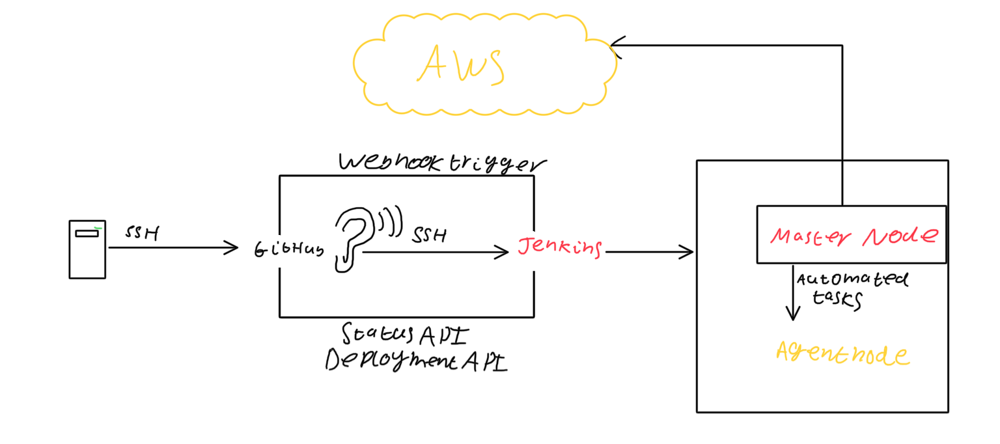
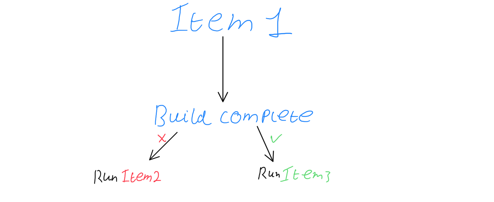

# Multi Machine automated deployment

Basic diagram on the basics of Jenkins
## Creating a Jenkins pipeline
So, what is the point of a pipeline:

It lets you run different items based on the outcomes of other items see! So let's make one:

1. Click New Item
2. Give it a name and click Freestyle project
3. Go down and add some build triggers, just make sure it can pass
4. Go to Post-Build Actions and type in the name of a project you'd like to run after this build has completed. You also have the option to trigger if build is stable, unstable or if it has failed
5. Build your project and check the console to see what it has done!